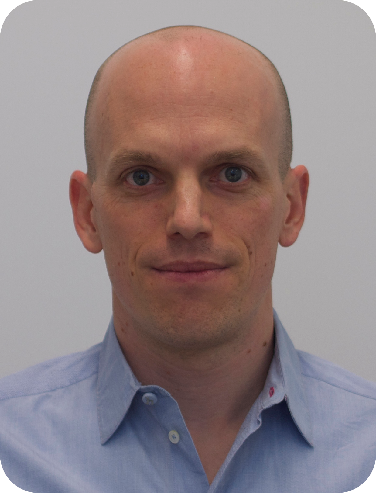

# Invited Speakers

## [Arthur Gretton (UCL)](https://www.gatsby.ucl.ac.uk/~gretton/)

#### Biography:
Arthur Gretton is a Professor with the Gatsby Computational Neuroscience Unit, director of the Centre for Computational Statistics and Machine Learning (CSML) at UCL, and an ELLIS Fellow. He received degrees in Physics and Systems Engineering from the Australian National University, and a PhD with Microsoft Research and the Signal Processing and Communications Laboratory at the University of Cambridge. He previously worked at the MPI for Biological Cybernetics, and at the Machine Learning Department, Carnegie Mellon University. 
Arthur's recent research interests in machine learning include causal inference and representation learning, design and training of generative models, and nonparametric hypothesis testing. He has been an associate editor at IEEE Transactions on Pattern Analysis and Machine Intelligence, an Action Editor for JMLR, Senior Area Chair for NeurIPS in 2018 and 2021 and ICML in 2022, a member of the COLT Program Committee in 2013, and a member of Royal Statistical Society Research Section Committee since January 2020. Arthur was program chair for AISTATS in 2016 (with Christian Robert), tutorials chair for ICML 2018 (with Ruslan Salakhutdinov), workshops chair for ICML 2019 (with Honglak Lee), program chair for the Dali workshop in 2019 (with Krikamol Muandet and Shakir Mohammed), and co-organsier of the Machine Learning Summer School 2019 in London (with Marc Deisenroth).

## [Shakir Mohammed (DeepMind)](https://shakirm.com/)

#### Biography:
Shakir Mohammed is a senior staff research scientist at DeepMind, London, having joined in 2013, where he works towards the goal of developing intelligent and general-purpose learning systems. He also leads a non-profit organisation called the Deep Learning Indaba, whose mission is to Strengthen African Machine Learning and Artificial Intelligence. He is an Associate Fellow at the Leverhulme Centre for the Future of Intelligence at the University of Cambridge, and an Honorary Professor in the Department of Computer Science at University College London (UCL).
He was a programme chair for DALI2019, a programme co-chair for ICLR2019, the Senior Programme Chair for ICLR2020 and the General Chair for ICLR2021. He is a member of the Royal Society’s Diversity Committee (2020-2023), and was elected to the Board of Directors of ICML and ICLR in 2019.
Before moving to London, he held a Junior Research Fellowship from the Canadian Institute for Advanced Research (CIFAR) as part of the programme on Neural Computation and Adaptive Perception. He was based in Vancouver at the University of British Columbia in the Laboratory for Computational Intelligence (LCI) with Nando de Freitas. He completed his PhD with Zoubin Ghahramani at the University of Cambridge, where he was a Commonwealth Scholar to the United Kingdom and a member of St John’s College. He is from South Africa, and completed his previous degrees in Electrical and Information Engineering at the University of the Witwatersrand, Johannesburg.

## [Tamara Broderick (MIT)](https://tamarabroderick.com/)

#### Biography:
Tamara Broderick is an Associate Professor in the Department of Electrical Engineering and Computer Science at MIT. She is a member of the MIT Laboratory for Information and Decision Systems (LIDS), the MIT Statistics and Data Science Center, and the Institute for Data, Systems, and Society (IDSS). She completed her Ph.D. in Statistics at the University of California, Berkeley in 2014. Previously, she received an AB in Mathematics from Princeton University (2007), a Master of Advanced Study for completion of Part III of the Mathematical Tripos from the University of Cambridge (2008), an MPhil by research in Physics from the University of Cambridge (2009), and an MS in Computer Science from the University of California, Berkeley (2013). Her recent research has focused on developing and analyzing models for scalable Bayesian machine learning. She has been awarded selection to the COPSS Leadership Academy (2021), an Early Career Grant (ECG) from the Office of Naval Research (2020), an AISTATS Notable Paper Award (2019), an NSF CAREER Award (2018), a Sloan Research Fellowship (2018), an Army Research Office Young Investigator Program (YIP) award (2017), Google Faculty Research Awards, an Amazon Research Award, the ISBA Lifetime Members Junior Researcher Award, the Savage Award (for an outstanding doctoral dissertation in Bayesian theory and methods), the Evelyn Fix Memorial Medal and Citation (for the Ph.D. student on the Berkeley campus showing the greatest promise in statistical research), the Berkeley Fellowship, an NSF Graduate Research Fellowship, a Marshall Scholarship, and the Phi Beta Kappa Prize (for the graduating Princeton senior with the highest academic average).
